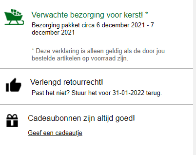
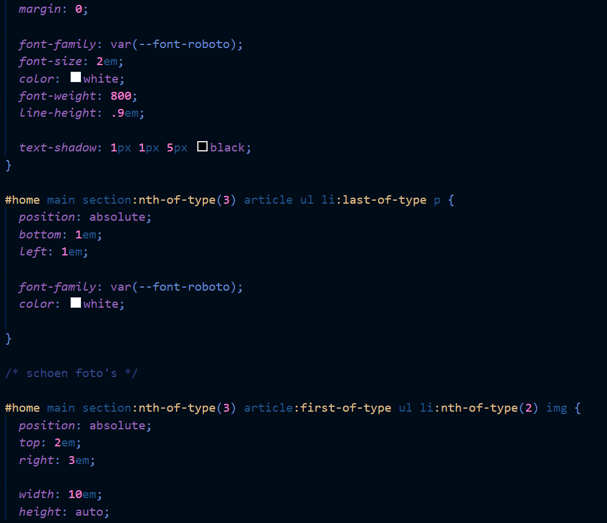

# Procesverslag
Markdown is een simpele manier om HTML te schrijven.  
Markdown cheat cheet: [Hulp bij het schrijven van Markdown](https://github.com/adam-p/markdown-here/wiki/Markdown-Cheatsheet).

Nb. De standaardstructuur en de spartaanse opmaak van de README.md zijn helemaal prima. Het gaat om de inhoud van je procesverslag. Besteedt de tijd voor pracht en praal aan je website.

Nb. Door *open* toe te voegen aan een *details* element kun je deze standaard open zetten. Fijn om dat steeds voor de relevante stuk(ken) te doen.

## Jij

uitwerken voor kick-off werkgroep

### Auteur:
Romy Jongkees

#### Je startniveau:
Blauw

#### Je focus:
Surface plane
 

## Je website

uitwerken voor kick-off werkgroep

### Je opdracht:
https://www.large.nl/

#### Screenshot(s) van de eerste pagina (small screen): 
hier de naam van de pagina  

#### Screenshot(s) van de tweede pagina (small screen):
hier de naam van de pagina  

Het was eerst het plan dat ik deze pagina zou doen, maar aangezien ik in tijdnood kwam is me dit nog niet gelukt.
 

## Breakdownschets (week 1)

uitwerken na afloop 2e werkgroep

### de hele pagina: 

## Voortgang 1 (week 2)

uitwerken voor 1e voortgang

### Stand van zaken
Ik heb nog niet zo heel veel gedaan. Mijn navigatiebalk is zo goed als 'af', hij werkt alleen nog niet. Ook ben ik bezig geweest met m'n zoekbalk, wat nogal stroef ging omdat ik het lastig vind alles op de juiste manier te positioneren.

### Agenda voor meeting
samen met je groepje opstellen

| student 1      | student 2          | student 3    | student 4        |
| ---            | ---                | ---          | ---              |
| Maken van een  | Caroussel          | en ik dit    | en dan ik dat    |
| zoekbalk       |                    | nog een punt | dit wil ik zeker |
| ...            | ...                | ...          | ...              |

### Verslag van meeting
hier na afloop snel de uitkomsten van de meeting vastleggen

Door in plaats van een knopje een plaatje naast mijn zoekbalk te plaatsen (van een vergrootglas) kan ik deze op een makkelijkere manier positioneren.

## Voortgang 2 (week 3)

uitwerken voor 2e voortgang

### Stand van zaken
In de les was ik al iets verder gekomen en had ik het onderstaande informatieblokje in elkaar kunnen zetten.

Veel verder was ik nog niet helemaal gekomen.

### Agenda voor meeting
samen met je groepje opstellen

| student 1      | student 2          | student 3    | student 4        |
| ---            | ---                | ---          | ---              |
| Mag een nav in | en dit             | en ik dit    | en dan ik dat    |
| je footer?     | dit als er tijd is | nog een punt | dit wil ik zeker |
| ...            | ...                | ...          | ...              |

### Verslag van meeting
hier na afloop snel de uitkomsten van de meeting vastleggen

Ik kreeg van 1 van de student-assistenten de opmerking dat ik lekker op weg was geweest met m'n breakdownschets, maar dat ik maar 1 H1 had gebruikt in totaal waardoor ik uiteindelijk zelfs H5'jes had staan. Hierna heb ik nog wat meer H1'tjes toegevoegd, waar ik uiteindelijk weer feedback op kreeg, dit bleek namelijk niet te mogen en eigenlijk mocht er maar 1 H1 op de site staan. Ik heb uiteindelijk niet genoeg tijd gehad om het aan te passen.

## Toegankelijkheidstest (week 4)

uitwerken na test in 8e voortgang

### Bevindingen
Lijst met je bevindingen die in de test naar voren kwamen:

Beperkt zicht brillen

Met de verschillende brillen die het moeilijk maakten om goed te kunnen zien was het lastig om op mijn site te navigeren. Wat aangepast zou kunnen worden is de tekstgrootte. Dit kan natuurlijk in zijn algemeen, maar er kan ook een optie voor toegevoegd kunnen worden.

Screenreader

Met de screenreader was het erg lastig om op mijn site te kunnen navigeren. Omdat ik nog geen alt teksten aan mijn afbeeldingen had toegevoegd, wist je niet wat voor plaatje het was. Ik heb het niet voor mekaar kunnen krijgen om headings en normale tekst op te kunnen lezen, dus dat heb ik niet kunnen testen.

Motoriek 

Door middel van het apparaatje wat je motoriek verstoort, kon je testen of mensen met een slechte motoriek ook op jou site kunnen navigeren. Ik merkte dat dit met dit apparaat erg lastig ging. Zelfs in de allerlaagste stand ging dit voor geen meter, en opende ik allemaal random dingen op mijn browser. Wat hieraan gedaan zou kunnen worden, is het groter te maken van knoppen, of een inzoomfunctie toe te voegen. Al betwijfel ik of mensen met net zo'n slechte motoriek als dit apparaatje immiteert, ook echt met een muis kunnen werken.

## Voortgang 3 (week 4)

uitwerken voor 3e voortgang

### Stand van zaken
Ik was al best lekker op weg tijdens dit voortgangsgesprek. Ik was nog niet heel erg ver, en wat ik tot nu toe gedaan had ging best lekker dus ik heb niet veel vragen gesteld.

### Agenda voor meeting
samen met je groepje opstellen

| student 1      | student 2          | student 3    | student 4        |
| ---            | ---                | ---          | ---              |
| Responsive     | en dit             | en ik dit    | en dan ik dat    |
| maken          | dit als er tijd is | nog een punt | dit wil ik zeker |
| ...            | ...                | ...          | ...              |

### Verslag van meeting
hier na afloop snel de uitkomsten van de meeting vastleggen

Het responsive maken van elementen kan het best gedaan worden met media query's. Ik ga eerst naar de surface plane kijken, aangezien ik dan in ieder geval 1 van de 2 opties heb.

## Eindgesprek (week 5)

uitwerken voor eindgesprek

### Stand van zaken
Na een inhaalsprint ben ik nog niet helemaal tevreden. Ik wilde namelijk meer leuke dingen toevoegen, maar aangezien ik midden in een verhuizing zit was het nog best lastig om alles op tijd af te krijgen. Daarom wil ik, maakt niet uit wat voor cijfer ik heb, sowieso nog gaan herkansen en mijn site sowieso responsive maken en meer punten uit de surface plane toevoegen, zoals de dark mode.

Ik had het laatste weekje nog veel te doen, maar met veel hulp van het internet en afentoe ook wat hulp van klasgenoten heb ik toch nog wat in elkaar kunnen zetten. 

Waar ik het meest mee heb zitten kloten is wel het positioneren van elementen. Vaak maak ik gebruik van flexbox, grid of position: absolute waardoor ik het telkens weer op een andere manier moet doen en een beetje in de war raak.

## Herkansing

uitwerken voor herkansing

### Stand van zaken
Na de eindbeoordeling had ik de tijd om verder te werken aan mijn website, en hem mooi te maken. Dit is naar mijn idee ook zeker gelukt, ik ben blij met hoe de site eruit ziet en ik vond het erg leuk om te experimenteren met verschillende animaties, states en andere dingen.
Onze docent, Vasilis, gunde degenen die het nog niet gehaald hadden nog een extra feedbackmoment om de stand van zaken te bekijken (nogmaals hartstikke bedankt hiervoor :) ). Hieruit kwam dat ik al veel beter op weg was, maar nog wel even moest kijken naar mijn formulier. Het is namelijk mogelijk om een :valid toe te voegen, waarmee je de opmaak kunt veranderen. Ik heb hiernaast ook nog een :invalid toegevoegd, zodat je ook kunt zien wanneer iets nog niet goed ingevuld is.

Ik had ook nog het idee om mijn site responsive te maken. Ik ga namelijk blok Tech doen en ik moet mijn portfolio nog maken, dus dan kan ik er vast mee oefenen. Helaas is dit mij uiteindelijk niet gelukt. Ik heb er erg veel tijd in gestoken om mijn hamburgermenu uit te laten klappen en mijn zoekbalk naast mijn menu items te positioneren wanneer het op een groter scherm bekeken werd. Dit probeerde ik te doen door middel van een voorbeeld van Sanne, die alleen flexbox gebruikte. Dit lukte mij niet. Ook heb ik de slides uit de les proberen te volgen, maar het kostte mij gewoon teveel tijd zonder veel progressie. Uiteindelijk heb ik geprobeert om de rest van mijn pagina responsive te maken, maar ik denk dat ik de verkeerde code heb getypt om dit makkelijk responsive te maken. Ik heb veel gebruik gemaakt van position: absolute, waardoor er telkens elementen verplaatsten als ik het scherm groter maakte en ik er uiteindelijk wel 20 media queries voor zou moeten schrijven (naar mijn idee). Ik weet vrijwel zeker dat hier een makkelijkere manier voor is, maar om de helft van mijn code opnieuw te schrijven voor de bonuspunten vond ik een beetje te gek.

Hier een voorbeeld uit mijn code, waarmee ik probeerde om mijn hamburger menu uit te klappen:

Ik heb het gevoel dat ik op de goede weg was, maar het bleek me toch nog te lastig.

## Bronnenlijst

continu bijhouden terwijl je werkt

Nb. Wees specifiek ('css-tricks' als bron is bijv. niet specifiek genoeg).

1. https://css-tricks.com/almanac/
2. https://www.w3schools.com/html/default.asp
3. https://www.youtube.com/
4. https://stackoverflow.com/
5. Klasgenoten
6. Lessen
7. https://codepen.io/P1N2O/pen/pyBNzX?editors=1100
8. https://css-tricks.com/gradient-borders-in-css/
9. https://www.digitalocean.com/community/tutorials/css-gradient-borders-pure-css
10. https://codepen.io/abirana/pen/GdzQRb?editors=1010
11. https://www.florin-pop.com/blog/2019/03/css-pulse-effect/
12. https://www.w3schools.com/html/html_form_input_types.asp

songs
1. https://www.youtube.com/watch?v=msPMIbrNEj8
2. https://www.youtube.com/watch?v=zrrwq1E9oFU
3. https://www.youtube.com/watch?v=Gy3BOmvLf2w
4. https://www.youtube.com/watch?v=x2rQzv8OWEY
5. https://www.youtube.com/watch?v=bePCRKGUwAY
6. https://www.youtube.com/watch?v=wtHra9tFISY

